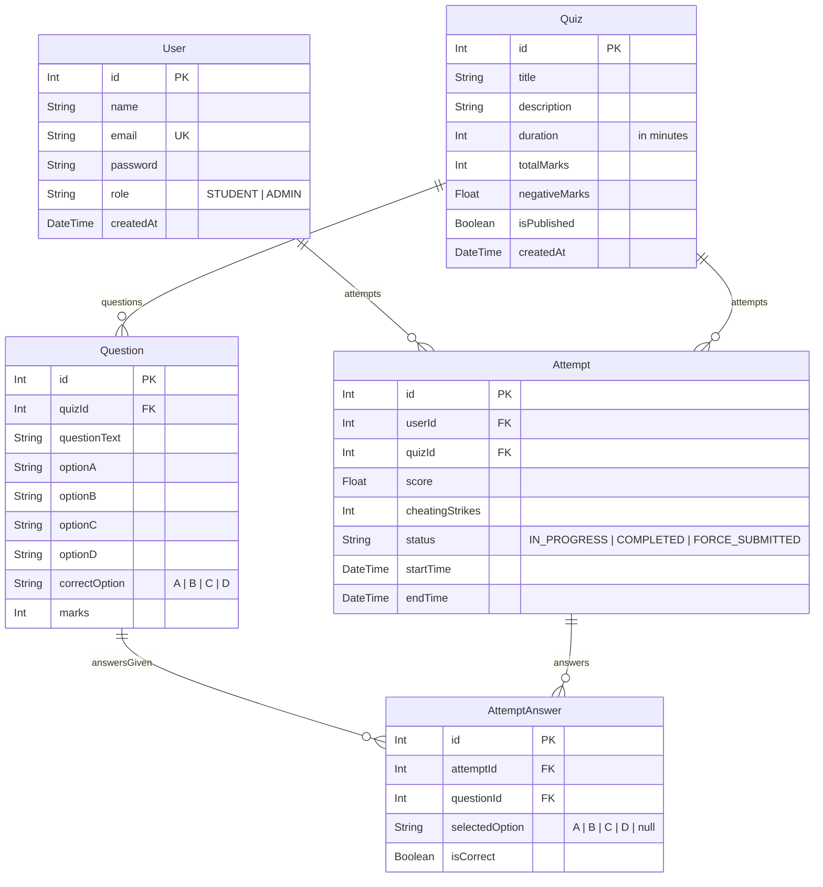

# 🌌 Online Quiz & Examination Portal (Express + React Three Fiber + Prisma)

Welcome to the **Online Quiz & Examination Portal**—a state-of-the-art, full-stack web application designed for academic evaluation, mock testing, and proctored examination workflows. 

This platform marries a powerful, secure backend grading engine with a gorgeous, high-fidelity glassmorphic frontend utilizing **3D WebGL interactive particle constellations** to provide a premium, modern user experience.

---

## 🚀 Distinctive Technical Highlights

### 1. 🛡️ Proctoring Anti-Cheat Engine (Multi-Layered Strike System)
Built with academic integrity in mind, the platform implements a highly advanced, multi-layered proctoring engine:
* **Focus & Event Interceptors:** Monitors visibility state changes, focus transitions (`blur`), and capturing-phase keyboard sequences (blocking developer consoles `F12`, `Cmd+Opt+I`, and page source lookups `Cmd+Opt+U`).
* **Permission Prompt Focus Safeguard:** Holds event listeners, selection cleaners, and polling loops completely **dormant** while browser camera/microphone permission dialogues are active. It employs a `1.2s` focus-restoration delay after permissions are resolved, **completely eliminating false cheating strikes** during initial calibration prompts.
* **Frosted Selection & Blur Lockout Workspace:** Blurs the entire question bank and navigation sidebar (`filter: blur(12px)`) with a centered frosted loading card (**"🔒 Secure Workspace Locked"**) while permissions are active. It smoothly unblurs into crystal-clear text the exact millisecond calibration completes.
* **Continuous Fullscreen Polling Hook (300ms Loop):** Since desktop browsers suppress standard keydown events for `Escape` during fullscreen exits for security, this active background thread polls `document.fullscreenElement` every 300ms. Exiting fullscreen by pressing `ESC` once instantly evaluates active state as `null`, registering the violation strike and locking the screen within 300ms.
* **High-Frequency Selection Cleansing Hook (100ms Loop):** Wipes out any active text selection ranges every 100ms in the background. Highlighting or selecting even a single character is physically impossible, completely neutralizing highlight bypasses or drag-to-cheat browser extensions.
* **Modern Clipboard Shielding:** Overrides modern `navigator.clipboard.writeText` APIs during exams to discard extension writes, and intercepts standard `copy`/`cut`/`paste` event buffers to overwrite clipboard data with a warning text (`⚠️ COPYING PROHIBITED IN SECURE EXAM ⚠️`).
* **Brutal Disqualification & Submission:** Each transgression registers a persistent cheating strike. Upon triggering **3 strikes** (or failing to re-enter secure fullscreen within 5 seconds), the engine triggers an automatic disqualification and grades the quiz instantly, locking the student out.

### 2. ⏱️ Resilient Stateful Exam Timer (Anti-Tampering)
Standard client-side timers are easily manipulated by modifying browser variables or pausing execution. This portal resolves this with a resilient backend-driven synchronization model:
* When an exam begins, a persistent timestamp is generated on the server (`startTime` + `duration`).
* On page refreshes, crashes, or network disconnects, the frontend instantly synchronizes with the backend.
* The backend computes the remaining seconds dynamically: `Remaining = (startTime + duration) - now`.
* If the remaining time hits `0` or goes negative, the server auto-submits and grades the attempt, preventing client-side timer manipulation.

### 3. 📊 Custom Composed Dashboard Chart & Student Audits
* **Dual-Axis Composed Analytics:** Evaluates both **Pass Rates (%)** (on the left Y-axis with a beautiful vertical purple gradient bar) and **Average Scores (Points)** (on the right Y-axis with an indigo glowing trend line).
* **Bespoke Glassmorphic Tooltip:** Renders detailed insights, including exact evaluation counts, pass percentages, and average scores formatted against the quiz's maximum marks.
* **Student Answer Audit Modal:** Admins can inspect a completed student attempt answer-by-answer. A frosted-glass overlay displays the exact option the student selected (marked in red if wrong, green if right), the correct key, points earned/lost, and proctoring strikes.

### 4. 📜 Dynamic PDF Certificate Generator
* Compiles customized **A4 Landscape certificates** on the fly using vector geometry and the `pdfkit` library.
* Automatically unlocks and generates downloadable PDFs for students who achieve a passing grade of **$\ge 60\%$** on any assessment.
* Employs authenticated download tokens mapped inside the auth middleware to allow direct browser opening securely.

---

## 🛠️ Technology Stack

| Layer | Technology | Purpose |
| --- | --- | --- |
| **Frontend** | **React 19 (Vite)** | Reactive single-page client interface |
| **3D Rendering** | **React Three Fiber (R3F) & Drei** | 3D WebGL particle constellation background with mouse parallax |
| **Styling** | **Vanilla CSS & Lucide Icons** | Custom glassmorphism, Outfit/Jakarta typography, and crisp iconography |
| **Backend** | **Node.js (Express)** | RESTful API, business logic, proctoring, and grading loops |
| **Database** | **SQLite via Prisma ORM** | Relational data persistence, migration control, and client-builder |
| **Security** | **JSON Web Tokens (JWT) & Bcrypt** | Secure password hashing and role-based access control (RBAC) |
| **PDF Processing** | **Pdfkit** | On-the-fly vector compilation of PDF achievements |

---

## 💾 Database Relational Schema

Below is the structured representation of the SQLite schema managed via **Prisma ORM**. The platform supports full cascading deletes—deleting a quiz automatically purges its question bank and student attempts clean.



---

## 🚀 Getting Started (Local Run Guide)

### System & Hardware Requirements
* **Node.js**: Ensure you have [Node.js (v18 or higher)](https://nodejs.org) installed.
* **Camera & Microphone**: Required for proctoring calibration and decibel noise visualization.
* **Modern Desktop Browser**: Compatible with Google Chrome (v100+), Safari (v15+), Mozilla Firefox, or Microsoft Edge. (Mobile/Tablet web browsers are not supported due to device-level fullscreen constraints).

---

### Step 1: Clone the Repository & Configure Workspace
Navigate to your target directory and clone the project:
```bash
git clone https://github.com/Ojaswi-Gupta/task_managrer_cog.git
cd task_managrer_cog
```

*(If you are running the project directly from your local folder, simply open terminal windows pointing to the `/backend` and `/frontend` directories).*

---

### Step 2: Initialize the Backend
1. Open a terminal, navigate to the `/backend` folder, and install dependencies:
   ```bash
   cd backend
   npm install
   ```
2. The database file `dev.db` is already initialized. However, if you ever want to reset it or run migrations from scratch:
   ```bash
   npx prisma db push
   ```
3. Run the database seed script to populate mock users, assessments, questions, and a pre-loaded student attempt:
   ```bash
   npm run seed
   ```
4. Boot up the backend API server (runs on Port `5001` via `nodemon` hot reloading):
   ```bash
   npm run dev
   ```
   *Console output: `🚀 Server running on http://localhost:5001`*

---

### Step 3: Initialize the Frontend
1. Open a **new terminal tab/window**, navigate to the `/frontend` folder, and install dependencies:
   ```bash
   cd frontend
   npm install
   ```
2. Start the Vite bundler development server:
   ```bash
   npm run dev
   ```
3. Open the printed URL (typically `http://localhost:5173`) in your browser to experience the application!

---

## 💡 Quick Demo Credentials

For seamless evaluation, use the following pre-loaded accounts in the Quick Login box:

* **Administrator Profile** (View stats, manage question banks, review student answer sheets):
  * **Email:** `admin@quizportal.com`
  * **Password:** `admin123`
* **Student Profile** (Attempt quizzes, trigger proctoring strikes, download certificates):
  * **Email:** `student@quizportal.com`
  * **Password:** `student123`

---

## 📂 Project Architecture

```text
java-full-stack/ (Workspace Root)
 ├── backend/
 │    ├── prisma/
 │    │    ├── schema.prisma   # SQLite Database Schema
 │    │    └── seed.js         # Db Seed Script (Quizzes, Questions, Attempts)
 │    ├── src/
 │    │    ├── controllers/
 │    │    │    ├── authController.js        # User auth, registration & JWT signing
 │    │    │    ├── quizController.js        # MCQ Question Bank & Quiz CRUD
 │    │    │    ├── attemptController.js     # Server timer validation & grading loops
 │    │    │    ├── analyticsController.js   # Leaderboards & composite dashboard queries
 │    │    │    └── certificateController.js # pdfkit landscape A4 rendering
 │    │    ├── middleware/
 │    │    │    └── authMiddleware.js        # JWT header & direct query fallback verification
 │    │    ├── routes/
 │    │    │    ├── authRoutes.js
 │    │    │    ├── quizRoutes.js
 │    │    │    ├── attemptRoutes.js
 │    │    │    ├── analyticsRoutes.js
 │    │    │    └── certificateRoutes.js
 │    │    ├── prisma.js                      # Shared client pool connector
 │    │    └── index.js                       # Sub-route registry
 │    ├── index.js                           # Express gateway entrypoint
 │    ├── .env                               # Port & secrets configurations
 │    └── package.json
 └── frontend/
      ├── src/
      │    ├── components/
      │    │    └── ThreeCanvas.jsx   # mouse-parallax 3D canvas system
      │    ├── context/
      │    │    └── AuthContext.jsx   # JWT sessions & Axios request interceptors
      │    ├── pages/
      │    │    ├── Login.jsx         # Access portal
      │    │    ├── StudentDashboard.jsx # Available boards, rankings & achievements
      │    │    ├── ExamPage.jsx      # Proctored full-screen console
      │    │    └── AdminDashboard.jsx # Statistics composed chart & audits modal
      │    ├── App.jsx                # Router config & WebGL layer overlay
      │    ├── App.css
      │    └── index.css              # Custom font tokens, glassmorphism UI rules
      └── package.json
```
